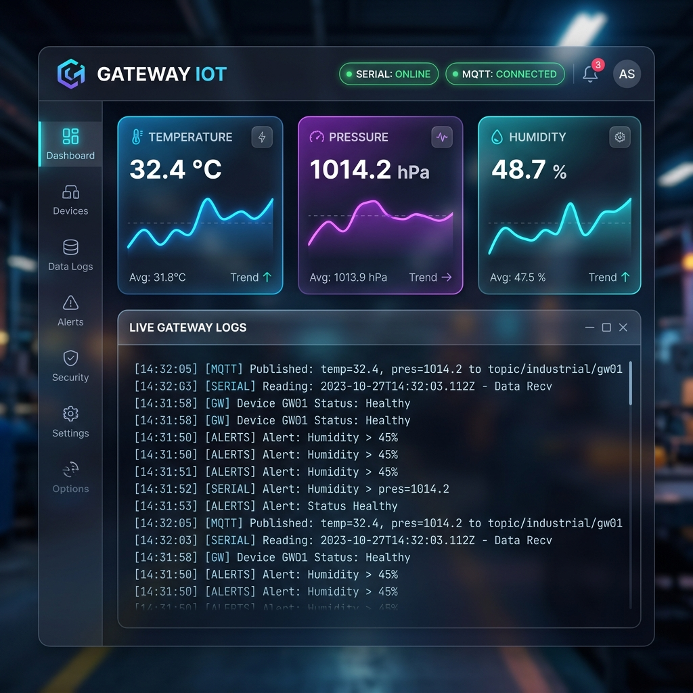

# Gateway IoT 📡 | Serial to MQTT Bridge

Un potente y estético **Gateway IoT** diseñado para comunicar hardware serial (Arduino, ESP32, Sensores) con un broker **MQTT** de forma sencilla, visual y profesional. Construido con una arquitectura moderna que separa el procesamiento de datos de la interfaz de usuario.



## 🚀 Características Principales

- **Dashboard High-Tech:** Interfaz moderna con diseño *Glassmorphism* para monitoreo en tiempo real.
- **Configuración Dinámica:** Cambia puertos COM, baudrates y parámetros MQTT directamente desde la web (sin tocar código).
- **Mapeo de Sensores:** Personaliza nombres y unidades de cada dato recibido para que tus tópicos MQTT tengan sentido.
- **Modo Simulación:** Prueba el sistema y el flujo MQTT sin necesidad de tener el hardware conectado.
- **Consola de Logs:** Depuración en tiempo vivo de las conexiones Serial y MQTT.
- **Portable:** Generado como un ejecutable independiente (.exe) para Windows.

## 🛠️ Stack Tecnológico

- **Backend:** [FastAPI](https://fastapi.tiangolo.com/) (Python Asíncrono)
- **Comunicación Real-Time:** [Socket.IO](https://socket.io/)
- **Protocolos:** 
  - [PySerial](https://pyserial.readthedocs.io/) para comunicación por puerto COM.
  - [Paho-MQTT v2.x](https://paho.mqtt.org/python/) para el envío de datos a la nube.
- **Frontend:** HTML5, CSS3 (Vanilla) y JavaScript Moderno.

## 📥 Instalación y Uso

### Opción A: Ejecutable (Recomendado para usuarios)
1. Ve a la carpeta `dist/`.
2. Ejecuta `GatewayIoT.exe`.
3. Se abrirá automáticamente tu navegador en `http://localhost:8000`.

### Opción B: Entorno de Desarrollo (Python)
Si deseas modificar el código o ejecutarlo desde el terminal:

1. Clona el repositorio:
   ```bash
   git clone https://github.com/tu-usuario/GatewayIoT.git
   cd GatewayIoT
   ```

2. Instala las dependencias:
   ```bash
   pip install -r requirements.txt
   ```

3. Ejecuta el servidor:
   ```bash
   python main.py
   ```

## ⚙️ Configuración del Protocolo Serial

El Gateway espera recibir tramas de datos separadas por `/` y delimitadas por `*` y `#`.

**Ejemplo de trama:** `*25.5/60/1013#`
- El sistema separará esto como 3 valores.
- En el Dashboard, puedes asignarles nombres como "Temperatura", "Humedad" y "Presión".
- Los tópicos MQTT resultantes serán: `base_topic/temperatura`, `base_topic/humedad`, etc.

## 📦 Cómo compilar tu propio .exe
Si realizas cambios en el código y quieres generar un nuevo ejecutable:

1. Asegúrate de tener `pyinstaller` instalado: `pip install pyinstaller`.
2. Ejecuta el comando usando el archivo `.spec` incluido:
   ```bash
   pyinstaller --noconfirm gateway_iot.spec
   ```
3. El resultado estará en la carpeta `dist/`.

---
## ⚡ Desarrollado por iSebas con Antigravity AI
Este proyecto ha sido concebido y desarrollado por **iSebas** utilizando **Antigravity**, demostrando la integración de hardware y software con interfaces industriales modernas.

---
## 📜 Licencia
© 2024 iSebas. Todos los derechos reservados.
Queda prohibida la reproducción, distribución o modificación sin autorización del autor.
